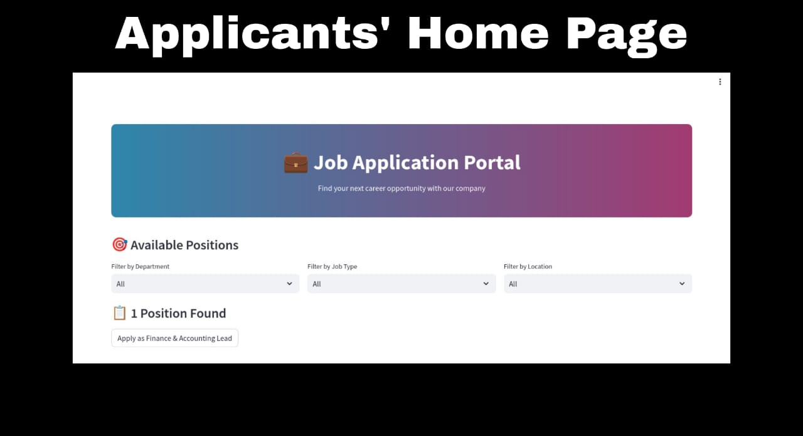
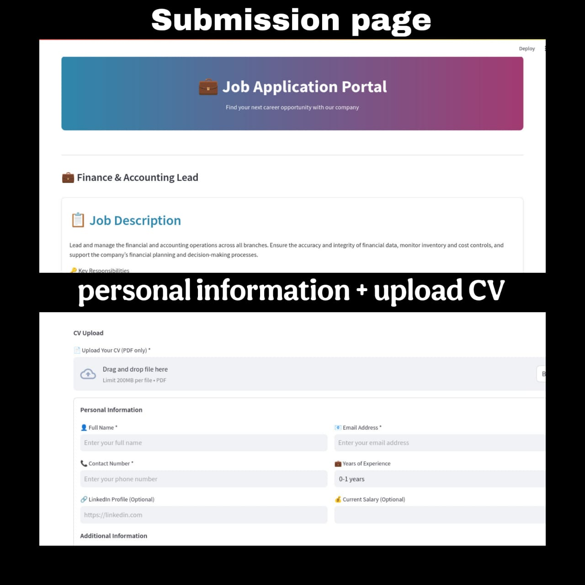
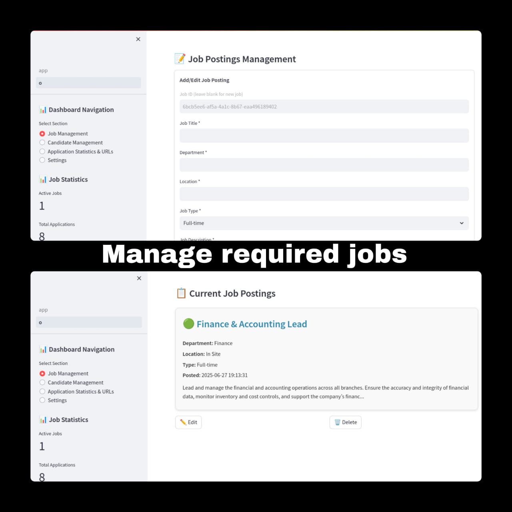
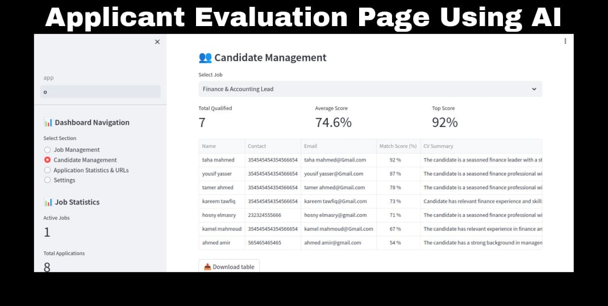
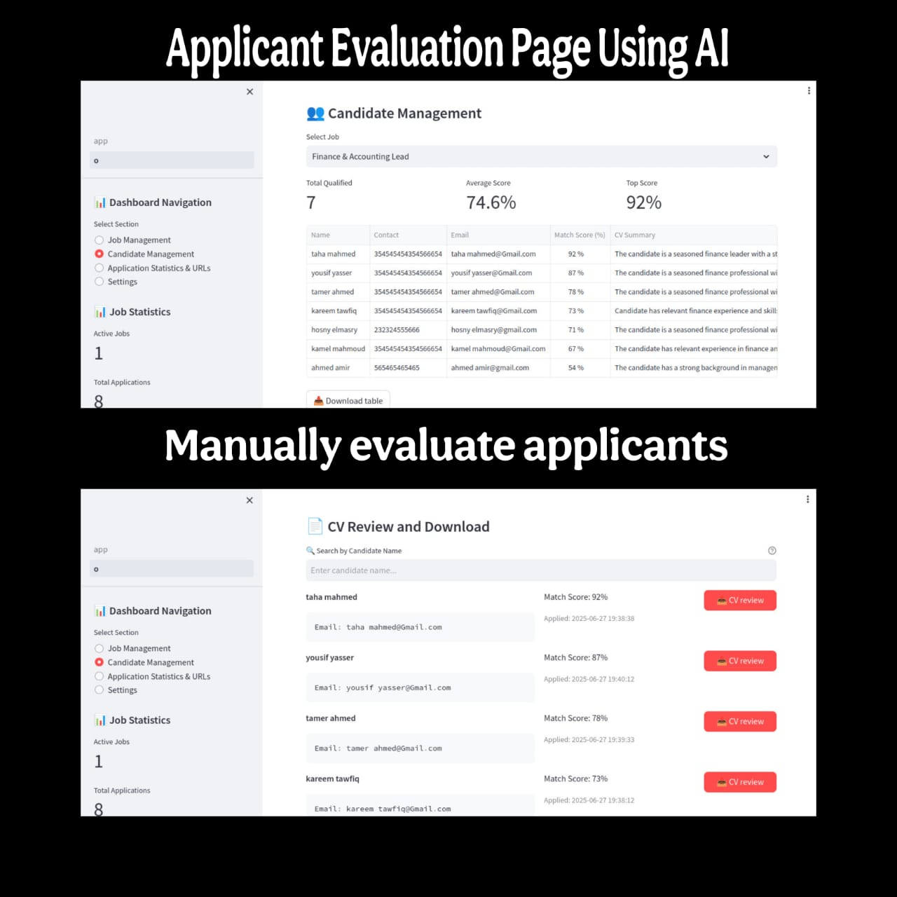

# Smart Hiring Hub - Applicant Tracking System (ATS)

## Project Overview
The **Smart Hiring Hub** is an innovative Applicant Tracking System (ATS) designed to streamline the recruitment process for companies. This web-based application allows employers to manage job postings, evaluate candidates using AI-driven matching, and provide applicants with an intuitive interface to submit applications. Built with Python (Streamlit), SQLite, and integrated with AI (chatgpt API), this project showcases a robust solution for modern hiring needs.

## Key Features
- **AI-Powered Candidate Matching**: Analyzes CVs and matches candidates to job requirements with precise scoring (1-100%).
- **Job Management**: Add, edit, or delete job postings with detailed descriptions and filters.
- **Candidate Management**: View, filter, and download candidate data with AI-generated summaries and match scores.
- **Application Submission**: User-friendly form for applicants to upload CVs and personal details.
- **Real-Time Statistics**: Visual dashboards for tracking applications and job performance.
- **Secure Access**: Admin dashboard with password protection.

## Live Demo
Explore the live version of the project here: [Smart Hiring Hub](https://smart-hiring-hub.onrender.com/)

## Usage Instructions
### For Applicants:
- Visit the live demo link above.
- Browse available positions using filters (Department, Job Type, Location).
- Click "Apply as [Job Title]" to fill out the application form.
- Upload your CV (PDF only, max 10MB) and submit your details.
- Await feedback based on your AI match score.

### For Employers/Companies:
- Access the admin dashboard (requires admin credentials).
- Manage job postings, review candidates, and download CVs.
- Use the statistics section to monitor application trends.
- Contact the developer for custom deployment or source code access.

## Screenshots and Page Descriptions

- **Description**: This is the main landing page for applicants. It features a welcoming "Job Application Portal" banner, filters for job search (Department, Job Type, Location), and a list of available positions (e.g., "Finance & Accounting Lead"). Applicants can click "Apply" to start the application process, making it easy to find and apply for suitable roles.

- **Description**: The submission page allows applicants to apply for a specific job (e.g., Finance & Accounting Lead). It includes a job description, a CV upload section (PDF only), and fields for personal information (name, email, contact, etc.). This page ensures a smooth application process with clear instructions and optional fields for additional details.

- **Description**: This admin page enables job management. Users can add/edit job postings with details like title, department, location, and type, or view current postings with options to edit or delete. It’s designed for HR teams to efficiently manage job listings and maintain an updated job board.

- **Description**: The AI-powered candidate management page displays a summary of applicants for a selected job (e.g., Finance & Accounting Lead). It shows the total qualified candidates, average match score (74.6%), and top score (92%), with a table listing candidate names, emails, match scores, and CV summaries. A download option is available for data export.

- **Description**: This page allows manual review of candidates’ CVs. It lists applicants with their match scores and provides a "CV Review" button to download individual CVs. The search bar enables filtering by name, offering a hands-on approach for HR to assess candidates beyond AI scoring.

## Customization and Collaboration
This project is a proof of my expertise in building scalable web applications with AI integration. The source code is not publicly available to protect intellectual property. If you’re a company or individual interested in deploying this ATS for your organization or acquiring the source code, please contact me directly:

- **Email**: [yahyamahroof35@gmail.com]
- **LinkedIn**: [https://www.linkedin.com/in/yahya-mahrouf]
- **FACEBOOK**: [https://www.facebook.com/yahya.m.marouf.2025]

I’m open to tailoring this solution to your specific needs, including adding new features or integrating it with your existing systems.

## License
© 2025 [Yahya Mahroof]. All rights reserved. This project is for demonstration purposes only. Commercial use or distribution of the source code requires explicit permission from the developer.
